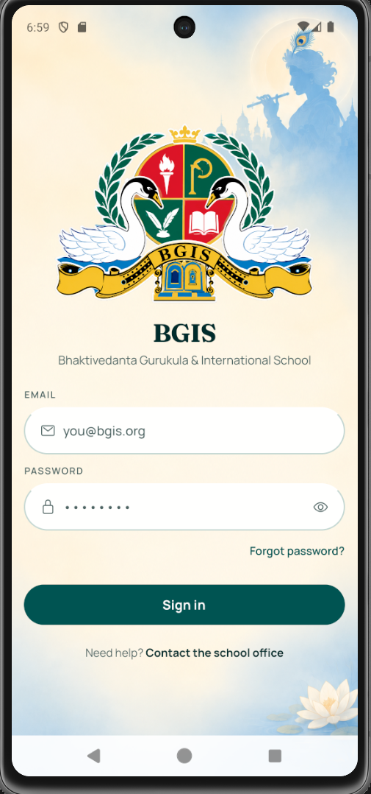
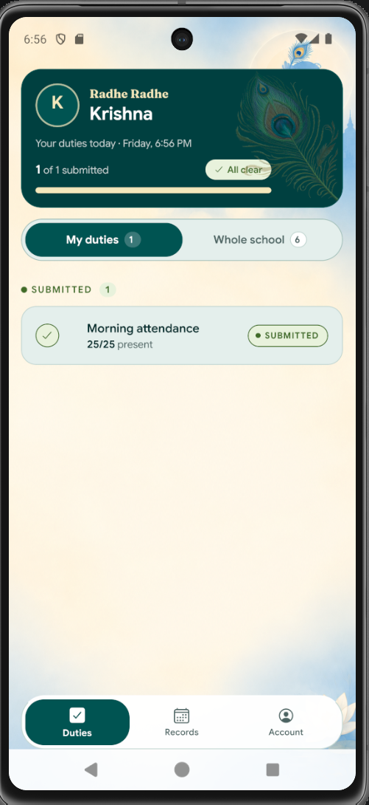
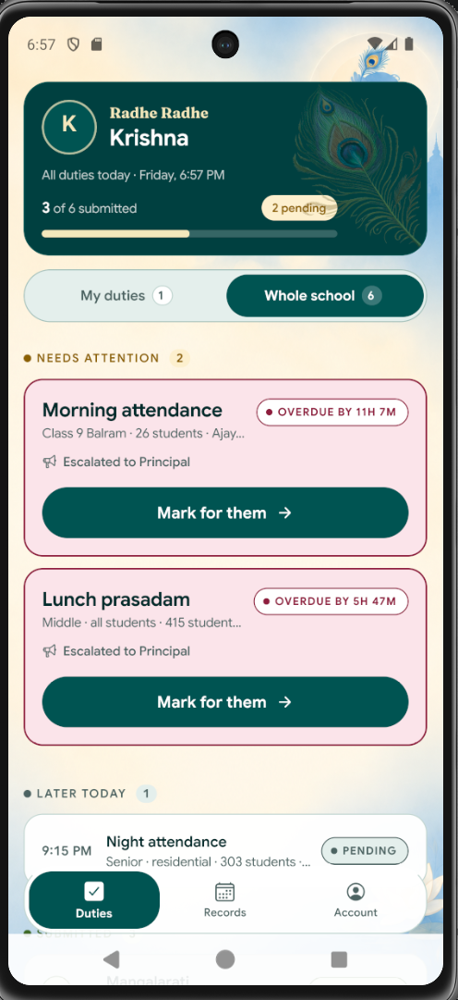
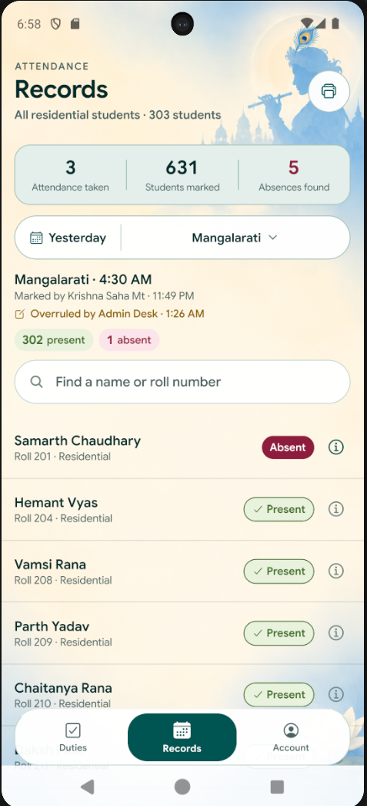
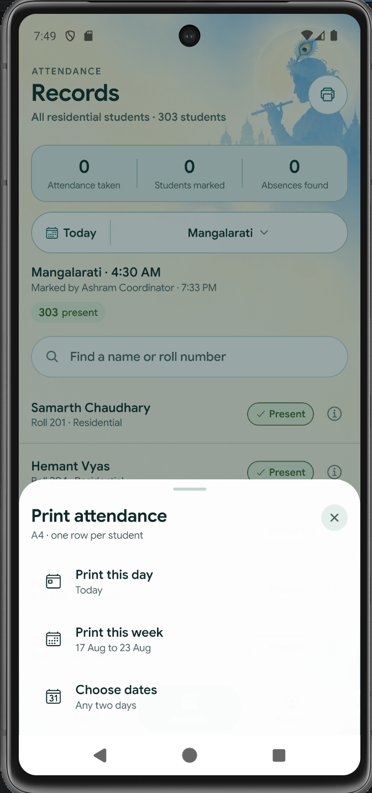
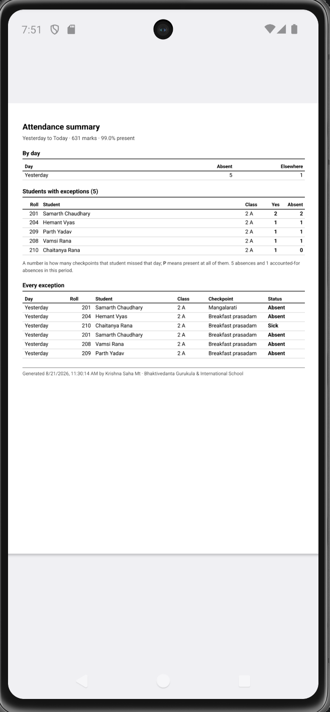
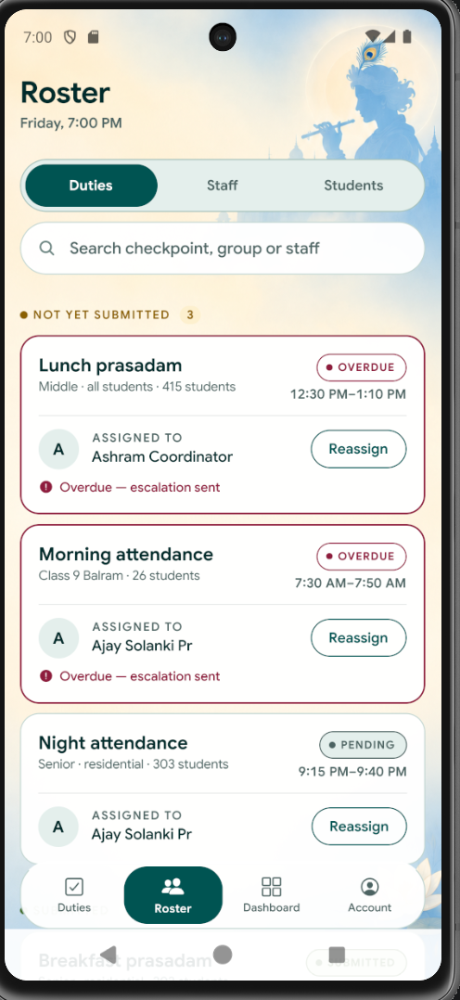
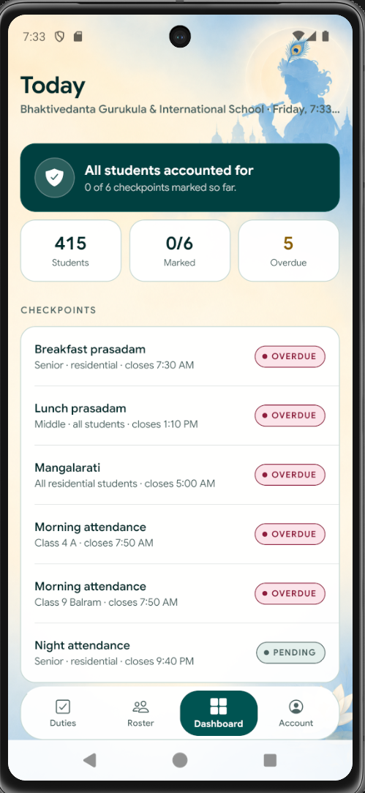
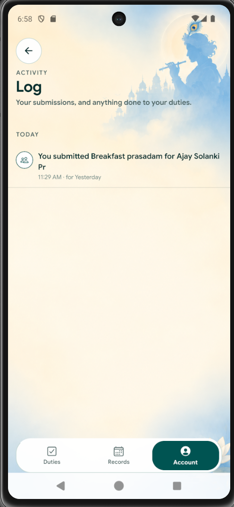
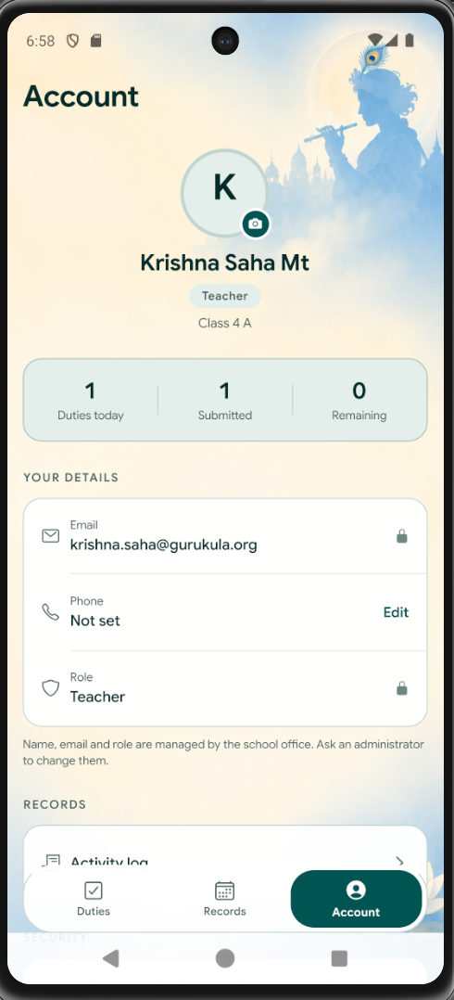

# BGIS Attendance — Attendance & Student Safety

Attendance for **Bhaktivedanta Gurukula and International School**: a residential
and day school of ~415 students in Grades 2–12, where roll is called 8–10 times
a day, from Mangalarati at 4:30 AM to night attendance at 9:15 PM.

Today that happens on paper proformas signed through a chain of teacher →
coordinator → MOD → principal. By the time a missing child is noticed, hours
can have passed.

**The app exists for one thing:** the moment a student is marked absent, it
checks whether that same child was present at an earlier checkpoint today. If
so, someone needs to go look for them — now, not at the end of the day.

---

## Screens

| | |
|---|---|
|  | **Sign in**<br/>One account per staff member. Role comes from the account, never from a picker — a teacher cannot choose to be an administrator. |
|  | **Duties**<br/>Your own duties for today, with a progress bar that reaches "All clear" only when every one is submitted. |
|  | **Cover marking**<br/>Switch to *Whole school* and any teacher can mark a colleague's overdue checkpoint. The duty stays theirs; the record shows who actually did it. Overdue cards carry the countdown and how far the escalation has gone. |
|  | **Records**<br/>Read any day back. Pick a date, pick a checkpoint, see everyone it covered. Tap a tally to float that group to the top, or search by name or roll. A correction shows on the record rather than replacing it. Prints to A4. |
|  | **Print**<br/>This day, this week, or any two dates. Each row states the dates it will use, so nothing depends on remembering what the screen behind it was set to. |
|  | **The printed sheet**<br/>One fixed type size and one column, so a 30-student sheet and a 700-student sheet are the same document at different lengths. A range prints the totals and every exception; a single day prints the full register. |
|  | **Roster**<br/>Coordinators reassign a duty for the day without touching the weekly default, and manage staff and the 415-student register. |
|  | **Dashboard**<br/>Management view. Leads with the number that matters — students still unaccounted for — then checkpoint progress. |
|  | **Activity log**<br/>Who did what, reached from Account. An administrator sees everything; coordinators and the MOD see the attendance record without the routine traffic; everyone else sees only entries naming them. |
|  | **Account**<br/>Profile photo and phone are yours to edit. Name, email and role are locked to the office. |

> Screens above are `docs/screenshots/2.1/` (21 Aug). Earlier sets are kept
> alongside — `1.1/` is the first build, from 28 July — so the interface can be
> read back over time rather than only in its current state.

---

## What it does

**Marking** — every student starts as Present; the teacher only touches the
exceptions. Tap a name for Absent, or pick Home / Sick / Activity / Outing /
Self study from a sheet. A 40-student group is markable in under two minutes,
which is the whole design constraint.

**The safety check** — when a duty is submitted, the day is walked in
checkpoint order to find children who were accounted for earlier and are absent
now. Those are separated from children who simply have not been seen yet, and
surfaced on the Dashboard. Resolving one is a single tap — *Found — safe now*,
*In the sick bay*, *Gone home* — with free text for anything else.

**Escalation** — a duty past its window shows who has been notified.
Meal and night checkpoints escalate straight to the Principal.

**Reading it back** — Records opens on the most recent day and goes back
through any date that has attendance. Scope is the *checkpoint's* group, so
Mangalarati lists all ~300 residential students and a class duty lists that
section. Tapping a student shows their whole day, plus their record over the
last 7 / 30 / 90 days.

**Overruling** — a coordinator, the MOD or an administrator can correct a
record a teacher has already submitted (SRS A6). The original submitter stays
on the record and the correction is attributed separately, so who marked it
and who changed it are both answerable.

**The audit trail** — submissions, cover marking, reassignments, overrules,
alert resolutions, role changes and sign-ins are written to `audit_log` by
database triggers, not by the app. There is no insert policy on that table:
nothing holding a user token can forge or delete an entry.

**Printing** — any day, any week, or any two dates, as an A4 PDF. One fixed
type size and one column throughout, so a 30-student sheet and a 700-student
sheet are the same document at different lengths.

**Roles** decide what exists in the app. A teacher sees Duties, Records and
Account. A coordinator also sees Roster and Dashboard. This is enforced by
Postgres row-level security, not by hiding buttons — a teacher's token cannot
write another teacher's submitted record even from a console.

---

## Stack

React Native (Expo) · Supabase (Postgres, Auth, Storage, RLS) · Google Sans

No CSS framework, no component library. Colours, spacing and type live in
`src/theme/theme.js` and everything reads from there.

---

## Running it

```bash
npm install
```

Create `.env` in the project root:

```
EXPO_PUBLIC_SUPABASE_URL=https://<project>.supabase.co
EXPO_PUBLIC_SUPABASE_ANON_KEY=<anon public key>
```

Use the **anon** key. The `service_role` key bypasses every security policy and
must never be in the app or the repo.

```bash
npx expo run:android    # builds and installs — required, see below
npx expo start          # day to day, once the build is on the device
npx expo start -c       # clear Metro's cache
```

**`expo run:android` is not optional.** Printing uses `expo-print`, which ships
native code, so the JavaScript bundle alone cannot run it — Expo Go and
`expo start -c` will both load the app happily and then fail the moment
someone taps Print. One rebuild is enough; after that `expo start` is fine
until the next native dependency.

Setting up a Supabase project from scratch is documented in
[`supabase/README.md`](supabase/README.md) — migrations `001`–`009`, seed data,
and a checklist for verifying the security policies actually hold. Run that
checklist: RLS failures are silent, and a policy that is too strict returns
zero rows rather than an error.

[`docs/reference/data-model.md`](docs/reference/data-model.md) documents every
table, what writes to it and who can read it.
[`docs/reference/reports.sql`](docs/reference/reports.sql) holds ready-made
queries for the office — per-student records, class summaries, repeat
absentees, the overrule trail.

---

## Layout

```
src/
  screens/        one file per screen
  components/     shared UI (Dialog, Avatar, GreetingHeader, …)
  domain/         business rules from the spec — pure functions, no React
  utils/          formatting helpers
  lib/            Supabase client and queries
  context/        auth and shared school data
  navigation/     role → tabs, and the tab bar
  theme/          colours, spacing, fonts
supabase/         migrations 001-009, seed, reset script
docs/
  reference/      data model and ready-made report queries
  data/           the student register
```

The rule: **data, rules and presentation stay apart.** A screen never queries
Supabase directly and never holds a rule. See
[`docs/ARCHITECTURE.md`](docs/ARCHITECTURE.md) before adding code.

---

## Status

**Working against real data:** sign-in with persistent sessions, the
415-student register, duties, marking and submission, cover marking, derived
safety alerts and their persisted resolutions, oversight overrule of a
submitted record, the audit trail, reading any past day, per-student history,
A4 printing, duty reassignment, profile photos, per-role database access.

**Not built yet:**

- Email summaries and reminder/escalation jobs — the ladder is displayed in the
  UI but nothing is sent
- Nightly duty generation from recurring defaults. Until it runs, the app falls
  back to the most recent day that has duties rather than showing an empty list
- Spanning statuses — Home/Sick/Outing that pre-fill later checkpoints
- Excel export in the school's proforma layouts (PDF is done)
- Offline marking
- Module F — gate passes and sick bay admissions

**Known schema gap:** `src/lib/duties.js` reads `band` and
`mandatory_escalation` from the duties table and neither column exists. Both
resolve silently to `null`/`false`, so band-scoped duties cannot be expressed
and the SRS C2 escalation rule has nothing to read. Needs a migration.

Detail and ordering in [`CLAUDE.md`](CLAUDE.md) §5.

---

## Notes for the team

Test accounts are in [`docs/dev-test-credentials.md`](docs/dev-test-credentials.md).
Disposable — delete them and issue real staff logins before rollout.

**The 415 student names in this repository are generated, not the school's
real roll.** Structure is real — admission numbers, all 23 class-sections, the
residential/day-scholar split — so everything behaves as it will in
production. See [`docs/data/README.md`](docs/data/README.md). When the real
register is imported, this repository must stop being public.

`supabase/reset-test-data.sql` clears attendance and returns every duty to
pending, for a clean run-through.

Everyone shares one Supabase project at the moment, so two people testing at
once will see each other's marks.
