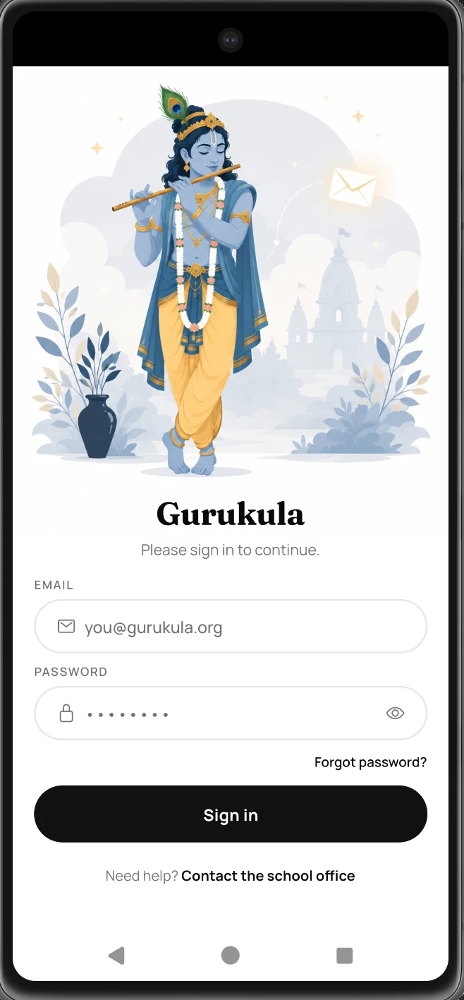
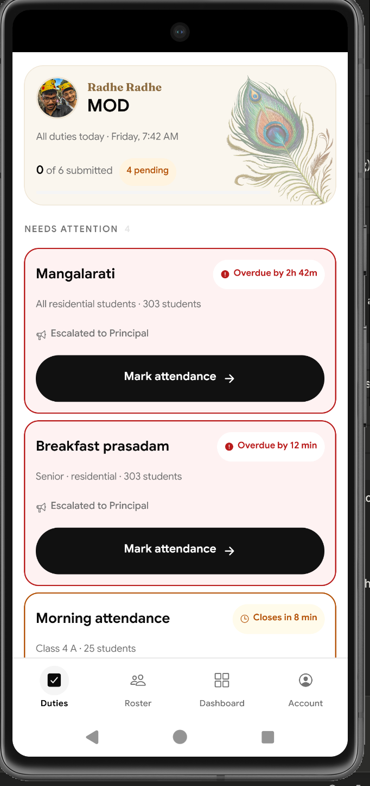
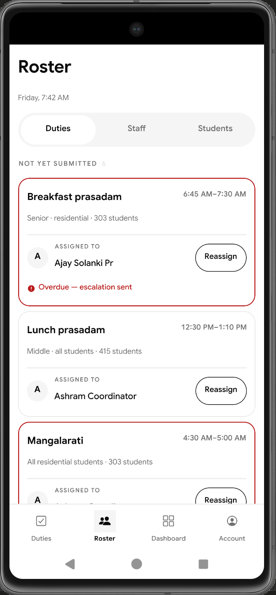
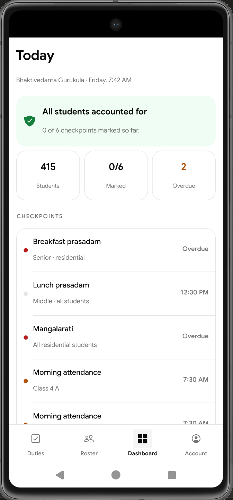
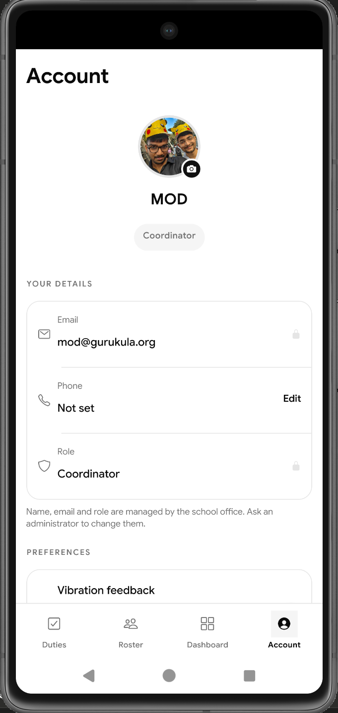

# BGIS Attendance — Attendance & Student Safety

Attendance for **Bhaktivedanta Gurukula and International School**: a residential
and day school of ~415 students in Grades 2–12, where roll is called 8–10 times
a day, from Mangalarati at 4:30 AM to night attendance at 9:15 PM.

Today that happens on paper proformas signed through a chain of teacher →
coordinator → MOD → principal. By the time a missing child is noticed, hours
can have passed.

**The app exists for one thing:** the moment a student is marked absent, it
checks whether that same child was present at an earlier checkpoint today. If
so, someone needs to go look for them — now, not at the end of the day.

---

## Screens

| | |
|---|---|
|  | **Sign in**<br/>One account per staff member. Role comes from the account, never from a picker — a teacher cannot choose to be an administrator. |
|  | **Duties**<br/>Only your own duties for today. Visual weight follows urgency: overdue and due-now get full cards with countdowns and escalation state; later ones collapse to a line. |
|  | **Roster**<br/>Coordinators reassign a duty for the day without touching the weekly default, and manage staff and the 415-student register. |
|  | **Dashboard**<br/>Management view. Leads with the number that matters — students still unaccounted for — then checkpoint progress. |
|  | **Account**<br/>Profile photo and phone are yours to edit. Name, email and role are locked to the office. |

---

## What it does

**Marking** — every student starts as Present; the teacher only touches the
exceptions. Tap a name for Absent, or pick Home / Sick / Activity / Outing /
Self study from a sheet. A 40-student group is markable in under two minutes,
which is the whole design constraint.

**The safety check** — when a duty is submitted, the day is walked in
checkpoint order to find children who were accounted for earlier and are absent
now. Those are separated from children who simply have not been seen yet, and
surfaced on the Dashboard. Resolving one is a single tap — *Found — safe now*,
*In the sick bay*, *Gone home* — with free text for anything else.

**Escalation** — a duty past its window shows who has been notified.
Meal and night checkpoints escalate straight to the Principal.

**Class day view** — a class teacher sees their own students across every
checkpoint marked so far today, by any duty teacher, as a dense table.

**Roles** decide what exists in the app. A teacher sees Duties, My Class and
Account. A coordinator also sees Roster and Dashboard. This is enforced by
Postgres row-level security, not by hiding buttons — a teacher's token cannot
read another class's data even from a console.

---

## Stack

React Native (Expo) · Supabase (Postgres, Auth, Storage, RLS) · Google Sans

No CSS framework, no component library. Colours, spacing and type live in
`src/theme/theme.js` and everything reads from there.

---

## Running it

```bash
npm install
```

Create `.env` in the project root:

```
EXPO_PUBLIC_SUPABASE_URL=https://<project>.supabase.co
EXPO_PUBLIC_SUPABASE_ANON_KEY=<anon public key>
```

Use the **anon** key. The `service_role` key bypasses every security policy and
must never be in the app or the repo.

```bash
npx expo start          # scan the QR with Expo Go
npx expo start -c       # clear the cache — needed after adding a native module
```

Setting up a Supabase project from scratch is documented in
[`supabase/README.md`](supabase/README.md) — migrations, seed data, and a
checklist for verifying the security policies actually hold.

---

## Layout

```
src/
  screens/        one file per screen
  components/     shared UI (Dialog, Avatar, GreetingHeader, …)
  domain/         business rules from the spec — pure functions, no React
  utils/          formatting helpers
  lib/            Supabase client and queries
  context/        auth and shared school data
  navigation/     role → tabs, and the tab bar
  theme/          colours, spacing, fonts
supabase/         migrations, seed, reset script
docs/             architecture notes and the original requirements
```

The rule: **data, rules and presentation stay apart.** A screen never queries
Supabase directly and never holds a rule. See
[`docs/ARCHITECTURE.md`](docs/ARCHITECTURE.md) before adding code.

---

## Status

**Working against real data:** sign-in with persistent sessions, the
415-student register, duties, marking and submission, derived safety alerts,
duty reassignment, profile photos, per-role database access.

**Not built yet:**

- Email summaries and reminder/escalation jobs — the ladder is displayed in the
  UI but nothing is sent
- Nightly duty generation from recurring defaults
- Persisted alert resolutions with an audit trail
- Spanning statuses — Home/Sick/Outing that pre-fill later checkpoints
- Reports and Excel export in the school's proforma layouts
- Offline marking

Detail and ordering in [`CLAUDE.md`](CLAUDE.md) §5.

---

## Notes for the team

Test accounts are in [`docs/dev-test-credentials.md`](docs/dev-test-credentials.md).
Disposable — delete them and issue real staff logins before rollout.

**The 415 student names in this repository are generated, not the school's
real roll.** Structure is real — admission numbers, all 23 class-sections, the
residential/day-scholar split — so everything behaves as it will in
production. See [`docs/data/README.md`](docs/data/README.md). When the real
register is imported, this repository must stop being public.

`supabase/reset-test-data.sql` clears attendance and returns every duty to
pending, for a clean run-through.

Everyone shares one Supabase project at the moment, so two people testing at
once will see each other's marks.
